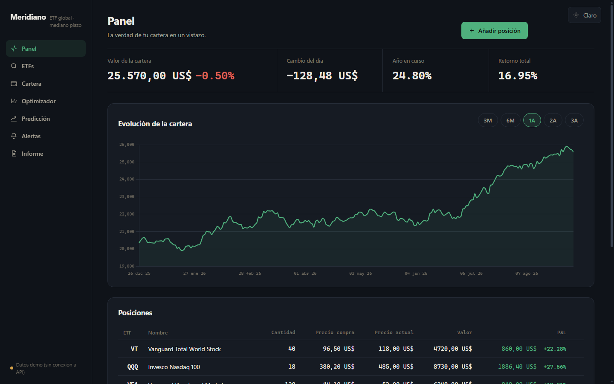
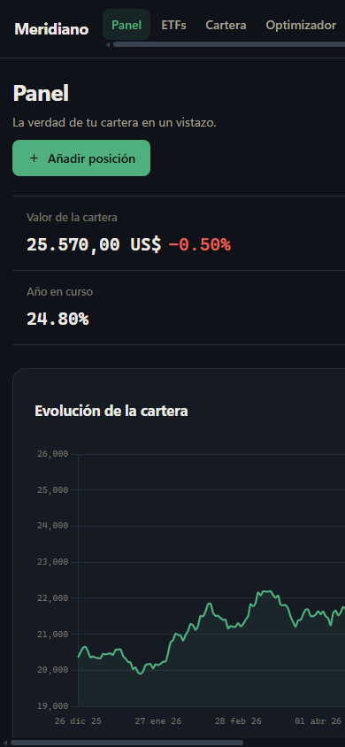

# Meridiano · Global ETF Analyzer

A Progressive Web App (PWA) for **medium-term global ETF investments** with a **market prediction module**. Built with a clean dark/light design following the impeccable skill standards (Operate mode, "patient investor's ledger" direction).

[](https://github.com/DeployModeIO/Finanzas)
[](https://github.com/DeployModeIO/Finanzas)

## Preview

Serve the folder with any static server (recommended for service worker):

```bash
python -m http.server 8080
```

Then open `http://localhost:8080`. Without a server, it also works by opening `index.html` directly (no offline mode or live data).

## Screenshots

### Desktop Dashboard



The full desktop experience with the navigation rail, KPI ledger, and portfolio overview.

### Mobile View



Responsive design adapts to mobile screens with a horizontal navigation bar.

## Features

- **Dashboard** — KPIs (value, day, YTD, total return), portfolio evolution, positions with P&L, allocation (donut) and tracking list.
- **ETFs** — Catalog of 40 global ETFs with search and filters by region/sector; detail with price, 50/200 moving averages, Bollinger Bands, RSI, MACD, Sharpe, drawdown, TER and AUM.
- **Portfolio** — Editable positions (IndexedDB), aggregate risk (volatility, Sharpe, drawdown, VaR 95%, mean correlation, CAGR) and rebalancing against target weights.
- **Optimizer** — Mean-variance efficient frontier and suggested allocation by profile (conservative / balanced / aggressive).
- **Prediction** — Educational models extracted from GitHub projects:
  - *Monte Carlo (GBM)* and *AR-lite* P10/P50/P90 bands — essence of `huseinzol05/Stock-Prediction-Models`.
  - *Quantitative score* (momentum, volatility, drawdown, TER → probability of beating S&P 500 in 12 months) — essence of `robertmartin8/MachineLearningStocks`.
  - *Q-learning agent* (buy / hold / sell with backtest) — essence of `AI4Finance-Foundation/FinRL` and `austin-starks/Deep-RL-Stocks`.
  - *Headline sentiment* via local NLP lexicon — essence of `shirosaidev/stocksight`.
- **Alerts** — Target price per ETF with cross above/below detection.
- **Report** — PDF export (jsPDF) with summary, positions and disclaimer.

## Data

- Fetches real daily prices from Yahoo Finance (3 years, no API key).
- If the API is not available (CORS/offline), it generates **deterministic demo series** by ticker and indicates it at all times ("demo" badge and flag on the rail).
- Predictive models are educational and **do not constitute financial advice**.

## Structure

```
index.html            App (single SPA by hash)
css/tokens.css        Light/dark tokens
css/app.css           Layout and components
js/catalog.js         ETF universe + deterministic demo generator
js/data.js            Yahoo Finance with demo fallback
js/indicators.js      SMA, EMA, RSI, MACD, Bollinger, Sharpe, VaR, drawdown
js/predict.js         Monte Carlo, AR-lite, logistic score, Q-agent, sentiment
js/portfolio.js       IndexedDB (positions and metadata)
js/optimizer.js       Mean-variance frontier, suggestions and rebalancing drift
js/charts.js          Themed Chart.js configuration
js/ui.js              Rendering of tables, KPIs and states
js/app.js             Controller (routes, modals, theme, actions)
sw.js                 Service worker offline-first
```

## Shortcuts

- `Esc` closes modals · tables and rows are keyboard navigable · theme is remembered in `localStorage` and by default follows the system.

## Disclaimer

This project is for educational purposes only. It does not provide financial advice, investment recommendations, or guarantees of returns. Always conduct your own research and consult with a qualified financial advisor before making investment decisions.

## License

MIT